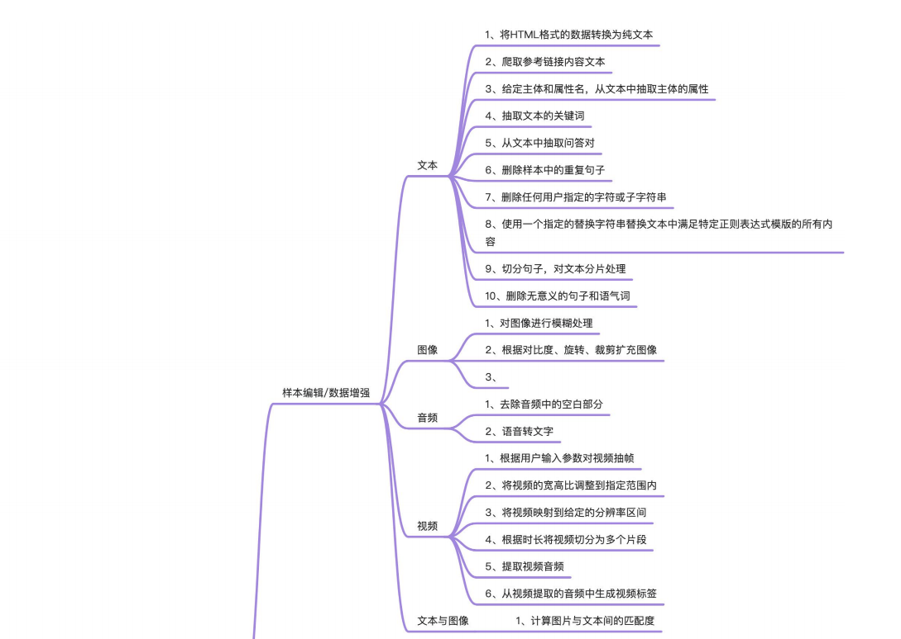
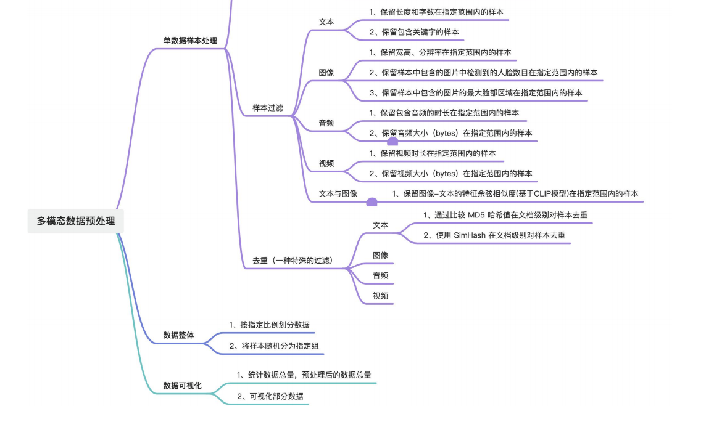

# 20241225-PaddleMIX数据处理RFC提案
|            |                       |
| ---------- | --------------------- |
| 提交作者   | huajiao-hjyp(何健飞)               |
| 提交时间   | 2024-12-25            |
| RFC 版本号 | v1.0                  |
| 文件名     | 20241225-PaddleMIX数据处理RFC提案.md |

# 1 概述
## 1.1 背景
`PaddleMIX`是基于飞桨的多模态大模型开发套件，聚合图像、文本、视频等多种模态，覆盖视觉语言预训练，微调，文生图，文生视频，多模态理解等丰富的多模态任务。

然而，训练多模态模型需要大量的数据，而这些数据的来源广泛，质量不一。因此，对数据的预处理显得尤为重要。通过预处理，能够提升数据集的质量，过滤掉低质量的数据，缩小数据范围，改善样本质量，从而提升模型的训练与推理速度。

## 1.2 目标
通过引入多个数据处理算子，帮助处理分析、清洗及生成大规模高质量多模态数据，提升数据质量，加快模型训练和推理的过程。

# 2 现状
目前`Paddle MIX`的`datacopilot`以`Schema`、`Dataset`和`ops`为核心。
* `Schema`用于定义多模态数据组织结构和字段名字。
* `MMDataset`作为数据操作的核心类，为存储，查看，转换，生成等操作的基本对象。
* `ops`是数据处理时具体的算子，目前仅支持少量的数据，可通过函数形式供`Dataset.map()`或`Dataset.fliter()`使用。

# 3 设计思路与实现方案
## 3.1 算子组织架构
### 3.1.1 算子基类
构建不同类型算子的基类，基类中定义`__call__()`方法，具体的算子实现`process_single(item)`方法进行数据处理。

```python
# 过滤类算子实现基类
class Filter():
    # 初始化函数，可传入配置
    def __init__(self, *args, **kwargs):
        pass

    # 链式调用时使用
    def __call__(self, *args, **kwargs):
        return self.run(dataset)

    # 处理整体数据集
    def run(self, dataset):
        for sample in dataset:
            process_singl(sample)

    # 处理单个数据集样本，需要实现类具体实现
    def process_single(self, sample):
        raise NotImplementedError
```

### 3.1.2 算子调用方式
目前`MMDataset`已定义了`MMDataset.map()`和`MMDataset.fliter()`函数，这两个函数都支持传入`Callable`类型的参数，所以可以在此基础上进行拓展。

`MMDataset.map()`和`MMDataset.fliter()`的区别在于，`MMDataset.map()`不会改变训练集的数量，只是对样本内容进行了修改；而`MMDataset.fliter`会改变训练集的数量，过滤某些样本。

所以对于新增的过滤类算子可以通过`Dataset.map()`函数调用，对于新增的样本处理算子可以通过`Dataset.fliter()`函数调用。

> PS：`MMDataset`应该对外暴露一个`process`接口，不区分`map`还是`fliter`，具体的数据处理逻辑下沉到算子自己处理，这样用户使用时不需要考虑这个算子是过滤还是编辑数据，后期如果可能还会增加其他类型的算子，也可以通过`process`处理，比如读取各种格式的文件。
> 这样做统一了调用接口，但会涉及到使用方式改变，待商议。

```python
# 定义加载数据算子（加载文件，构建数据集样本item）
textLoad = TextLoad(path)

# 定义数据过滤算子（按长度过滤）
textLengthFliter = TextLengthFliter(length, **)

# 定义数据样本处理算子（去除句子中重复单词）
textRemoveDumpMapper = TextRemoveDumpMapper(**)

# 支持链式调用，同时也支持传入算子列表
dataset = MMDataset().process(textLoad)
            .process([textLengthFliter, textRemoveDumpMapper])
```

## 3.2 算子实现列表
本方案从`单数据样本处理`和`数据整体`两个角度出发，同时结合不同的`处理目标`（样本编辑/数据增强、样本过滤、去重）和`数据模态`（文本、图像、视频、音频、文本与图像），提出多种数据处理算子，旨在丰富`Paddle MIX`数据预处理算子，简化数据处理流程，提升数据质量。

首先，将单数据样本处理划分为`样本编辑/数据增强`、`样本过滤`、`去重`三个子方向，每个方向根据数据模态的不同提出了多种数据处理算子。
* `样本编辑/数据增强`旨在对数据样本进行编辑处理，提升数据样本质量；或依据已有数据来扩充数据，丰富数据多样性。
* `样本过滤`旨在根据用户指令筛选高质量数据集，去除一些低质量的数据样本，从而减少数据样本，加快训练速度；过滤数据指将不符合条件的数据剔除，从而减少训练样本，提升数据集质量，对于模型训练的速度和效果都会有提升。
* `去重`旨在将数据集中的重复数据过滤，是一种特殊的数据过滤，同样也可以减少数据样本。

具体地，具体的算子实现列表如下所示：




|            | 
| ---------- | 
| `数据处理算子` |
| - |
|`（样本编辑/数据增强）文本模态 `|
| 将HTML格式的数据转换为纯文本 |
| 爬取参考链接内容文本 |
| 给定主体和属性名，从文本中抽取主体的属性 |
| 抽取文本的关键词 |
| 从文本中抽取问答对 |
| 删除样本中的重复句子 |
| 删除任何用户指定的字符或子字符串 |
| 使用一个指定的替换字符串替换文本中满足特定正则表达式模版的所有内容 |
| 切分句子，对文本分片处理 |
| 删除无意义的句子和语气词 |
| - |
| `（样本编辑/数据增强）图像模态 `|
| 对图像进行模糊处理| 
| 根据对比度、旋转、裁剪扩充图像 |
| - |
| `（样本编辑/数据增强）音频模态` |
| 去除音频中的空白部分 |
| 语音转文字 |
| - |
|`（样本编辑/数据增强）视频模态` |
| 根据用户输入参数对视频抽帧 |
| 将视频的宽高比调整到指定范围内 |
| 将视频映射到给定的分辨率区间 |
| 根据时长将视频切分为多个片段 |
| 提取视频音频 |
| 从视频提取的音频中生成视频标签 |
| - |
|`（样本过滤）文本模态` |
| 保留长度和字数在指定范围内的样本 |
| 保留包含关键字的样本 |
| - |
|`（样本过滤）图像模态 `|
| 保留宽高、分辨率在指定范围内的样本 |
| 保留样本中包含的图片中检测到的人脸数目在指定范围内的样本 |
| 保留样本中包含的图片的最大脸部区域在指定范围内的样本 |
| - |
| `（样本过滤）音频模态` |
| 保留包含音频的时长在指定范围内的样本 |
| 保留音频大小（bytes）在指定范围内的样本 |
| - |
| `（样本过滤）视频模态` |
| 保留视频时长在指定范围内的样本 |
| 保留视频大小（bytes）在指定范围内的样本 |
| - |
| `（样本过滤）文本与图像模态` |
| 保留图像-文本的特征余弦相似度(基于CLIP模型)在指定范围内的样本 |
| - |
| `（去重）文本模态` | 
| 通过比较 MD5 哈希值在文档级别对样本去重 |
| 使用 SimHash 在文档级别对样本去重 |

# 4 可行性分析和排期规划
搭建基础架构和基类实现 + 三个处理文本算子（一周）

其余算子（三周，尽量提前）

